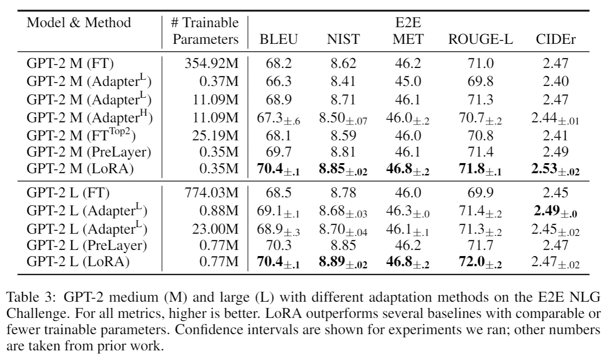
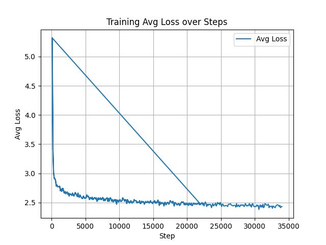
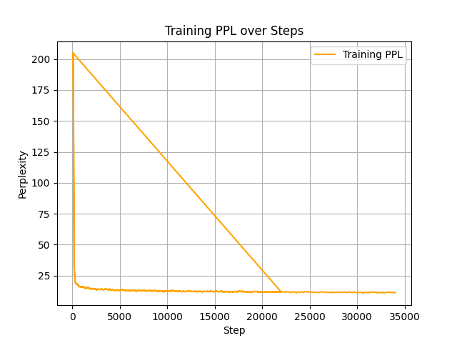
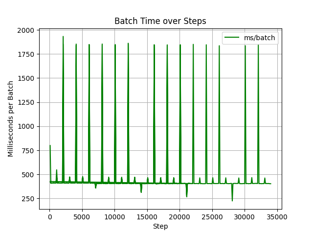

#  LoRA-based Fine-tuning with Jittor

This project implements parameter-efficient fine-tuning of GPT/LLaMA-like models using the [Jittor](https://cg.cs.tsinghua.edu.cn/jittor/) framework, with PyTorch compatibility provided by JTorch. It supports complete pipelines for data preparation, training, inference, and evaluation.

---

## Environment Setup

We recommend using Python 3.8 with CUDA 11.3. The following steps guide you through setting up the environment:

```bash
# Create and activate virtual environment
python3.8 -m venv jt-env
source jt-env/bin/activate

# Upgrade pip toolchain
pip install --upgrade pip setuptools wheel

# Install Jittor (adjust version to match your CUDA)
pip install jittor==1.3.8.5

# Install JTorch (PyTorch API compatibility layer for Jittor)
pip install jtorch==0.1.7

pip install -r requirements.txt
```
## Replication Process
### `Step 1: Clone the Repository`
### `Step 2: Prepare the dataset`
`cd data_prepare`

`bash create_datasets.sh`

`cd ..`

### `Step 3: Download pretrained model checkpoints`

`bash download_pretrain_checkpoints.sh`

### `Step 4: Start fine-tuning`

`bash finetune.sh`

### `Step 5: Run inference (generate outputs)`

`bash run_inference.sh`

### `Step 6: Download official evaluation scripts (BLEU / METEOR / NIST, etc.)`

`cd eval`

`bash download_evalscript.sh`

`cd ..`

### `Step 7: Run evaluation script`

`bash run_metric.sh`


##  Alignment with PyTorch Implementation

To ensure correctness and performance, we compared our Jittor+LoRA implementation with the PyTorch baseline under identical configurations.

| Framework | BLEU  | NIST  | METEOR | ROUGE_L | CIDEr|
|-----------|-------|-------|--------|---------|------|
| PyTorch   | 70.4  | 8.85  | 46.80  | 71.8    | 2.53 |
| Jittor    | 69.0  | 8.68  | 46.36  | 71.3    | 2.51 |


###  Loss and PPL curves





=======
